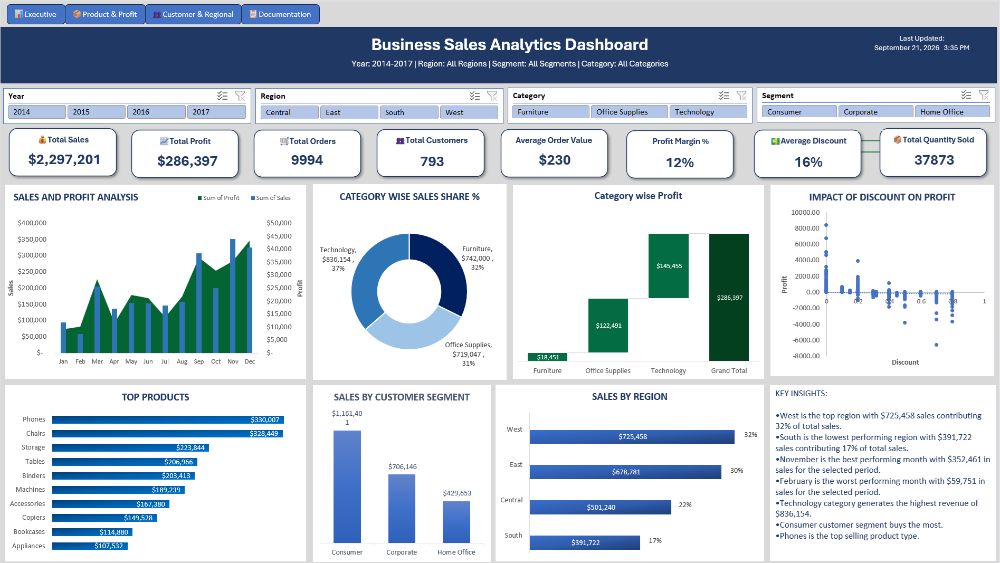
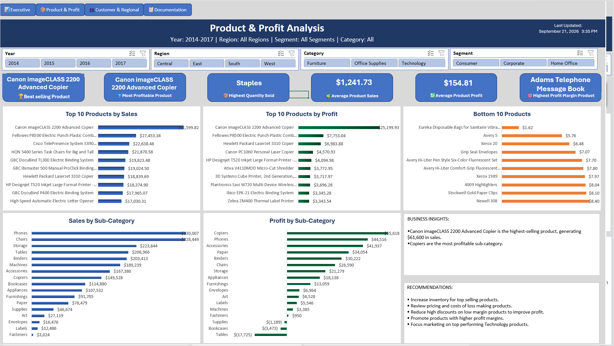
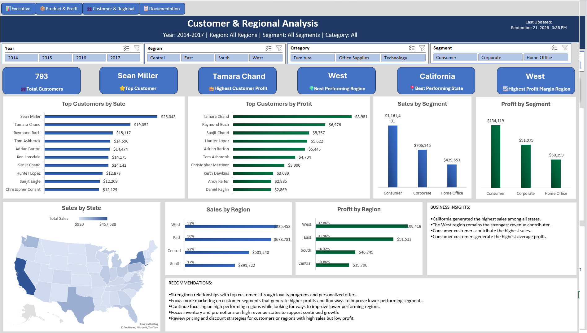

## 📊 Project Overview

This project analyzes business sales data using **Microsoft Excel** to identify sales trends, top-performing products, regional performance, and factors affecting profitability.

The raw sales data was cleaned and transformed using **Power Query** before being used for analysis and dashboard creation.

The cleaned data was then used to build PivotTables, PivotCharts, KPIs, and interactive slicers for the final dashboard.

The project demonstrates practical Excel skills including **data cleaning with Power Query, PivotTables, PivotCharts, slicers, calculated fields, conditional formatting, and dashboard design**.

## 🛠️ Tools & Skills

* Microsoft Excel
* Power Query
* PivotTables & PivotCharts
* Slicers
* Data Cleaning & Transformation
* Data Analysis
* Dashboard Design
* KPI Analysis
* Conditional Formatting
* Data Visualization

## 📁 Dataset

The project uses the **Sample Superstore** dataset, which contains sales transaction information including:

* Orders
* Customers
* Products
* Categories
* Sales
* Profit
* Discounts
* Regions
* States
* Order Dates

## 📈 Dashboard Features

The interactive dashboard includes:

* **Total Sales**
* **Total Profit**
* **Total Orders**
* **Profit Margin**
* Monthly sales trends
* Sales and profit by category
* Top-performing products
* Regional and state-level performance
* Sales distribution by region
* Interactive year and category filtering
* Map-based sales analysis

## 🔍 Key Insights

The analysis identified several important business patterns:

* The **West region** generated the highest sales among the four regions.
* **Technology** was the highest-revenue category.
* **Phones** were among the top-performing products by sales.
* Higher discounts were generally associated with lower profit.
* Sales performance varied considerably across regions and states.
* A small number of products and locations contributed a significant portion of overall sales.

## 💡 Recommendations

Based on the analysis:

* Strengthen relationships with top customers through loyalty programs and personalized offers.
* Allocate more marketing resources to customer segments that consistently generate higher profits while exploring strategies to improve lower-performing segments.
* Continue investing in high-performing regions while identifying opportunities to improve lower-performing regions.
* Prioritize inventory and promotional activities in high-revenue states to support continued growth.
* Review discount strategies to balance sales growth with profitability.

## 📷 Dashboard Preview

### Business Sales Analytics Dashboard

### Product and Profit Analysis

### Customer and Regional Analysis

## 📚 What I Learned

This project helped me strengthen my Excel skills by working with a larger dataset and building an interactive dashboard from raw sales data.

I practiced using PivotTables, PivotCharts, slicers, formulas, conditional formatting, and dashboard layouts to turn data into information that can be used for business analysis.

## 👩‍💻 Project Purpose

This project is part of my **data analytics portfolio** and demonstrates my ability to use Excel to clean, analyze, visualize, and communicate business data.
